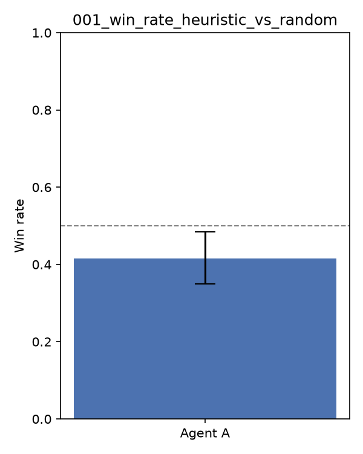

# Experiment 001 — Baseline: Heuristic vs. Random

## Goal

Prove the full pipeline end-to-end: deck construction → local self-play → win-rate
evaluation → packaged submission. Not an attempt at a strong agent yet.

## Setup

- **Agent A**: `agents.heuristic_agent` — greedily ranks legal options by a fixed
  priority table (ATTACK > EVOLVE > ATTACH > PLAY > ABILITY > YES > NO > RETREAT > END),
  no lookahead.
- **Agent B**: `agents.random_agent` — picks uniformly among legal options.
- **Deck**: `data/decks/baseline_v1.csv` — a mono-Fire deck (6 distinct Basic
  Pokémon x4 copies + Fire Energy filler), used by both agents (mirror match).
- **Matches**: 200, seed 42, first-player alternated per match to cancel first-move advantage.

## Result

| Metric | Value |
|---|---|
| Win rate (A vs B) | **41.5%** (95% Wilson CI: 34.9%–48.4%) |
| Draws | 0 |
| Aborted matches | 0 |

## Reading the result

The heuristic agent did **not** beat random here — its win rate is below 50%,
and the CI doesn't even reach even. A supplementary run with the same setup
(reason codes tracked) shows why: match endings break down as roughly
**53% deck-out** (a player's deck ran out on their draw step), **13%
no-Pokémon-in-play**, and only **33%** decided by an actual KO race (0 prize
cards remaining). With this deck, over half of all matches are decided by
turn-parity/deck-out rather than by which player made better decisions —
a weak signal for comparing agent quality. The heuristic's "always attack /
always develop" policy doesn't influence how fast either side decks out
(draw is automatic once per turn regardless of how many actions are taken),
so it's plausible it's just noise at n=200 rather than the heuristic being
actively harmful — but it's equally possible the greedy priority order itself
is suboptimal (e.g. attacking without regard to whether it trades well, or
never discarding to thin the deck). Both are worth investigating in 002.

## Pipeline verification

- 0 aborted matches across 200 games — the arena harness, agent contract, and
  engine integration are stable end-to-end.
- `pytest` (8 tests) passes: deck legality, agent-returns-legal-selection for
  both agents, single-match and n-match arena runs.
- A packaged submission (`submissions/exp001-heuristic/`) was assembled from
  `agents/heuristic_agent.py` and structurally matches the official
  `sample_submission/` layout (`main.py` + `deck.csv` + `cg/`).

## Next steps (002 candidates)

- Track *why* the heuristic loses: log per-match reason and whether the
  heuristic was on the deck-out side more often than chance.
- Try a deck with actual card-draw/resource support instead of pure mono-energy,
  so combat decisions (not deck-out timing) dominate outcomes.
- Revisit the greedy priority table — e.g. only attack when it doesn't leave
  the active Pokémon in a bad trade, or de-prioritize RETREAT unless forced.
- Confirm exact deckbuilding rules (copy limits, ACE SPEC) against the
  competition's official Rules page via the `competition-researcher` subagent —
  `validate_deck()` currently uses standard Pokémon TCG rules as a best-effort default.
