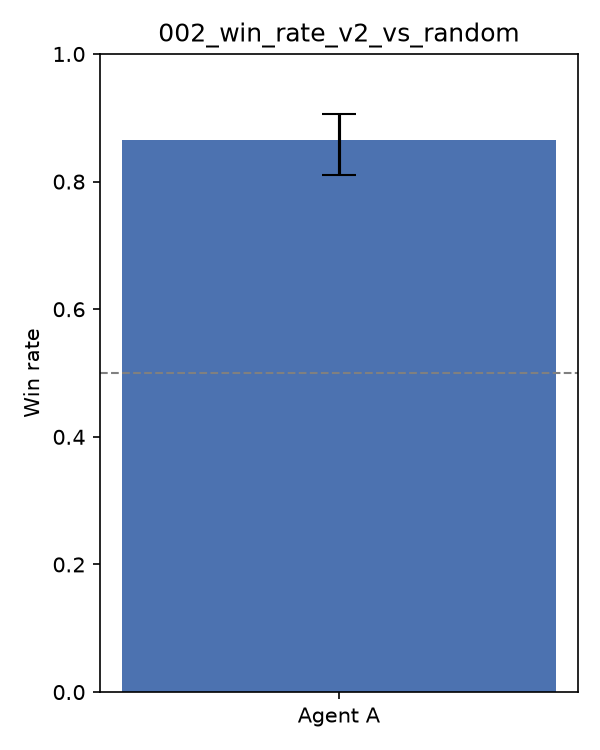

# Experiment 002 — Deck Optimization + Lethal-Aware Heuristic

## Goal

Improve on experiment 001's result (heuristic agent lost to random, 41.5% win
rate) toward the user's target of a strong Kaggle leaderboard rating (aiming
for 800+; the leaderboard score is a Gaussian skill rating starting at μ=600,
so "800" means sustained wins against a climbing opponent pool, not a fixed
benchmark). Community discussion/notebooks on this competition consistently
say **deck quality matters more than agent sophistication**, especially early
on — this experiment tests that directly by changing the deck and the agent
separately.

## Changes from 001

1. **Deck** (`deck.build_optimized_mono_deck`): Basic Pokémon are now chosen by
   damage-per-energy efficiency (best attack `damage / len(energies)`), tie-broken
   by lower retreat cost and higher HP, instead of arbitrary pool order. Added
   card-draw Item/Supporter cards (found by searching each card's skill text for
   "draw", programmatically — no card text is printed anywhere) to address 001's
   finding that >50% of matches ended from decking out rather than combat.
2. **Agent** (`agents.heuristic_v2_agent`): adds lethal-attack detection (does this
   attack's damage — with a crude weakness x2 / resistance -20 adjustment — meet or
   exceed the opponent's active Pokémon's current HP?) and ranks non-lethal attacks
   by estimated damage, instead of treating all ATTACK options as equally preferred.

## Results (200 matches each, seed 42)

| Matchup | Win rate (A) | 95% CI |
|---|---|---|
| v2 agent + new deck **vs** random + new deck | **86.5%** | 81.1–90.6% |
| v1 agent (001's logic) + new deck **vs** random + new deck | **82.5%** | 76.6–87.1% |
| v2 agent **vs** v1 agent, both on the new deck | 49.0% | 42.2–55.9% |

## Reading the result

The new deck alone (v1's simple agent logic, just given the better deck) already
reaches 82.5% vs random — almost all of the gain. Swapping in the v2 agent's
lethal-detection/damage-scoring on top of the same deck adds only ~4 points
(86.5% vs 82.5%), and head-to-head v2 vs v1 on identical decks is statistically
even (49%, CI straddles 50%). **This matches what the competition's community
discussion says: deck quality dominates over agent sophistication at this
stage.** The end-reason breakdown confirms *why* the deck change worked: for
v2-agent-vs-random, matches are now decided by an actual KO race (reason=1,
prize cards) **82.5%** of the time, vs. only 33% in experiment 001 — decking
out dropped from >50% to 10%. The draw-support cards fixed the structural
problem 001 identified, rather than the smarter attack-scoring doing the work.

## Submission

Packaged and submitted `agents.heuristic_v2_agent` + `optimized_v2.csv` to the
live Kaggle ladder. Note for interpreting the resulting leaderboard score:
**resubmitting resets an agent's skill rating back to μ=600** regardless of the
previous submission's rating, so the score will start low again and needs
enough games to climb/converge — it is not directly comparable to a
same-day score from the previous (001) submission.

## Next steps (003 candidates)

- The v2-vs-v1 near-tie suggests the next real gain is elsewhere: try more
  distinct attacker lines, evolution-line decks (deliberately avoided here since
  the agent has no evolve-timing logic), or more draw/search support cards.
- Confirm the actual per-move time budget (unconfirmed in research — sources
  agree a limit exists but not the exact number) before investing in
  `cg.api.search_begin/search_step` lookahead.
- Track real leaderboard μ/σ once Kaggle reports it, rather than only local
  win rate vs. our own baselines.
