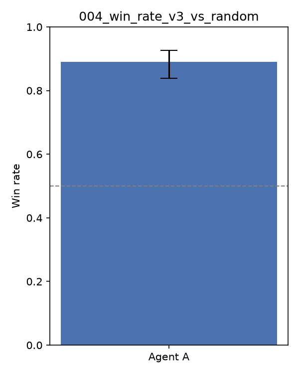

# Experiment 004 — Measure 2: Defensive/Resource-Targeting Agent

## Goal

Second of three parallel measures after 002. Where 002/003 changed the deck,
this holds the deck fixed (002's Fire deck, `optimized_v2.csv`) and only
changes agent logic, adding a defensive dimension v2 didn't have:

1. Retreat when the active Pokémon is critically damaged (≤30% max HP) and a
   healthy bench Pokémon is available, instead of always deprioritizing RETREAT.
2. When switching in a new active Pokémon, prefer the healthiest bench option.
3. Target energy attachment at whichever Pokémon most needs it to attack.

## A regression, then a fix

The first version of (3) scored attach targets purely by "fewest additional
energy needed to attack," regardless of whether the target was the active
Pokémon or a benched one. Head-to-head against 002's `heuristic_v2_agent` on
the same deck, this **lost 39.5%** — worse than v2, despite being "smarter."
Redirecting energy off the active attacker toward a bench Pokémon that's
merely closer to *its own* readiness slows down the active attacker's own
race to knock out the opponent first, which matters more than efficient
resource allocation in a fast KO-race meta. Fixed by keeping the active
attacker as the default energy target, only redirecting to the bench once the
active no longer needs more energy.

## Results (200 matches, seed 42, after the fix)

| Matchup | Win rate (A) | 95% CI |
|---|---|---|
| v3 agent **vs** random (same deck as 002) | **89.0%** | 83.9–92.6% |
| v3 agent **vs** v2 agent, same deck | **54.5%** | 47.6–61.3% |

v3 is a modest, real improvement on v2: +2.5pp vs random (86.5% → 89.0%), and
a small edge head-to-head (54.5%, though the CI still straddles 50%, so
treat this as "probably slightly better," not conclusively so at n=200).

## Reading the result

Unlike 002 (where the deck explained nearly all of the gain and the agent
logic barely mattered), here the *agent* is the only variable and it does move
the needle — just by a smaller amount, and only after catching a real
regression from an intuitively-reasonable-looking change (efficient energy
allocation) that actually worked against the goal (winning the race). The
lesson generalizes: any heuristic that isn't scored against the current best
agent, not just against random, can look like an improvement while actually
being a regression — random is too weak an opponent to reveal tempo trade-offs.

## Submission

Packaged and submitted `agents.heuristic_v3_agent` + `optimized_v2.csv` (the
002 deck, unchanged) to the live Kaggle ladder as a separate entry from 002/003.

## Next steps

- The retreat-when-critical threshold (30% max HP) and the "prefer active"
  energy bias are both hand-picked constants — worth a small sweep once there's
  a reliable local proxy for real ladder performance (e.g. vs. a pool of the
  003 Water deck, not just random/v2).
- Combine with 003's Water deck once both measures are compared on the real
  leaderboard, if both submissions outperform 002.
