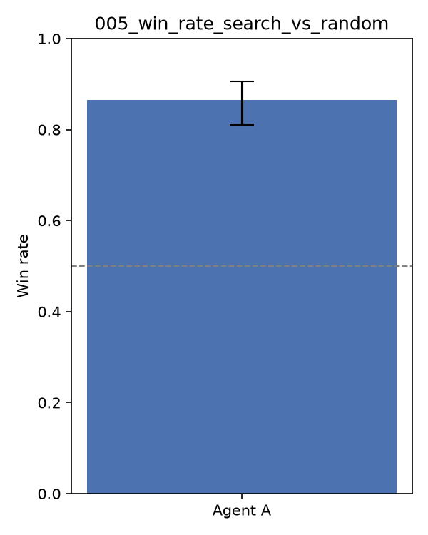

# Experiment 005 — Measure 3: Search-Based Lookahead Agent

## Goal

Third of three parallel measures after 002. Uses the engine-provided
`cg.api.search_begin`/`search_step` hypothetical-search API — mentioned as a
"stretch" idea in 002's write-up but not tried until now — instead of only
static heuristics, for the MAIN-menu decision (attack / develop / retreat / end).

## Method

For each legal MAIN option, take one `search_step` from a `search_begin` root
and evaluate the resulting hypothetical `State`: prize progress dominates
(`(opponent prizes taken - our prizes taken) * 1000`), total remaining HP
across our Pokémon minus the opponent's is the tiebreak. Pick the
highest-scoring option. Falls back to `heuristic_v2_agent`'s static scoring
(identical logic) whenever search isn't offered for this decision, or if
anything about the search call raises — this agent must never crash regardless
of how wrong its hidden-information guesses turn out to be.

**Important limitation**: `search_begin` requires guesses for hidden
information — our own remaining deck/prize contents, and the opponent's entire
deck/prize/hand. Our own guess is grounded in our known 60-card decklist minus
what we've directly observed in hand/discard/play. The opponent's guess is a
uniform sample over the whole ~1267-card pool — completely uninformed, since we
have no way to know what they're actually playing. So this is a genuinely rough
model of "what could happen next," not an accurate one.

## Results (200 matches, seed 42, deck unchanged from 002)

| Matchup | Win rate (A) | 95% CI |
|---|---|---|
| search agent **vs** random | 86.5% | 81.1–90.6% |
| search agent **vs** v2 agent, same deck | 53.0% | 46.1–59.8% |

Performance overhead was negligible: one full match (all decisions, both
sides, including the ~40-80 search calls on this agent's turns) ran in ~0.15s
locally — the native engine makes `search_begin`/`search_step` cheap. No
per-move timeout concerns at this scale, though the real competition's exact
timeout is still unconfirmed (see 002's write-up).

## Reading the result

Essentially a wash: 86.5% vs random matches 002/003's numbers exactly, and
53.0% vs v2 is barely above 50% (CI still straddles it). The 1-ply lookahead
with an uninformed opponent-hand guess doesn't clearly beat the purely static
v2 heuristic at this depth. This is a believable outcome, not a bug: with
almost no accurate information about the opponent's hidden cards, a 1-ply
search's main advantage over static heuristics — anticipating what happens
*after* an action — is undermined by the guess being wrong most of the time.
The evaluation function itself (prize progress + HP) is also close to what
v2's damage-based scoring already approximates for a single attack decision,
so there wasn't much room for the extra machinery to pay off at 1 ply.

## Submission

Packaged and submitted `agents.search_agent` + `optimized_v2.csv` (the 002
deck, unchanged) to the live Kaggle ladder as a separate entry.

## Next steps

- Deeper search (2+ ply) or many-sample averaging over the hidden-information
  guess (rather than one arbitrary guess) would likely help more than search
  depth alone, given the guess quality is the real bottleneck here, not the
  lookahead mechanism itself.
- A learned or frequency-based opponent-deck model (e.g. tracking what
  archetypes are common on the ladder) would make the opponent-hand guess far
  less uninformed than uniform-random sampling.
- Combine with 003/004's improvements once the real leaderboard shows which
  of the three measures actually moved the score, rather than guessing from
  local self-play alone.
